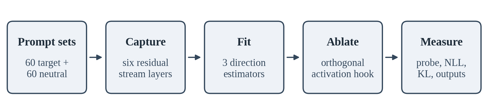

# Surgical Concept Erasure in GPT-2

*A single concept ablation study with measured limits*

**Zoe Faith Gumise**
September 2026

---

## Abstract

I evaluate whether a linear intervention on a transformer's residual stream can remove a named concept in practice. The archived experiment uses GPT-2 and a Mickey Mouse prompt set, compares a LEACE-derived direction at layer 5, and scores linear-probe accuracy, negative log-likelihood (NLL), and neutral-prompt locality KL. At the edited layer, the probe falls from 0.975 to 0.058; neutral NLL rises by 0.240 nats and locality KL is 0.061. This is strong evidence of local linear suppression, not durable unlearning. The target signal returns at deeper layers: at layer 10, probe accuracy is 0.942 after single-layer ablation versus 0.951 before it. Ablating multiple layers does not solve the problem and imposes a larger neutral-NLL cost. The saved generations are too weak and inconsistent to establish factual forgetting. The main result is therefore a boundary: a simple activation-space edit can suppress a probe at its intervention site, while a lexically cued concept remains available to downstream computation.

**Keywords:** mechanistic interpretability; concept erasure; activation ablation; representation editing; evaluation

## 1. Introduction

The appeal of concept erasure is straightforward: if a target attribute is represented along a direction in activation space, a forward-pass intervention might suppress that direction without changing billions of model parameters. This is a useful experimental question, but a removed vector is not automatically a forgotten fact. Information may be distributed across features, represented nonlinearly, or reconstructed from the prompt as it passes through later layers. Prior work establishes linear erasure methods and model-editing approaches, but each operates under different assumptions about what is stored and what counts as removal [1-3].

This paper reports what the saved GPT-2 run supports and where it stops. The target was one lexically explicit concept, Mickey Mouse. The measurement asks whether a cross-validated linear classifier can separate target from neutral prompt activations, and whether the edit changes neutral-text likelihood and next-token distributions. The evidence supports a large collapse of decodability at layer 5. It also shows that this collapse does not persist through the network. I therefore do not claim a general success rate, copyright removal, or model unlearning. The study is a single-model, single-concept case study of a local intervention and its failure modes.

I use *concept direction* operationally: a direction or low-dimensional span estimated from labeled activations. It is not a claim that a concept has one literal coordinate in the model. For a unit direction *v*, the hook removes the component *h*′ = *h* − (*h* · *v*)*v*. Weights stay fixed; removing the hook restores the unedited forward pass.

## 2. Methods

The run loads GPT-2 (124M parameters) and uses 60 Mickey Mouse prompts and 60 neutral prompts. It captures the final-prompt-token residual activations at six candidate layers (4, 5, 6, 8, 9, 10). Three estimators were active in this run: difference-in-means, a LEACE-derived estimator, and INLP. The codebase also contains PCA, but PCA was not included in the saved run configuration. Eighteen layer-estimator candidates were scored.

For selection, the code applies each candidate temporarily, measures a probe on the first 40 prompts from each class, and measures neutral NLL on 20 prompts. It minimizes |*a* − 0.5| + max(0, ΔNLL), where *a* is accuracy. The final scorecard remeasures with all 60 activation examples per class, five-fold stratified cross-validation, seed 0, and NLL on 30 prompts. Neutral locality KL compares baseline and edited next-token distributions on up to 40 neutral prompts.

A technical distinction matters: the fitted LEACE matrix is converted to a singular-vector subspace, then the shared activation hook applies an orthogonal projection onto that subspace. The run is therefore LEACE-derived, but the forward hook does not apply the full oblique LEACE matrix directly. This implementation detail narrows what the result can establish about LEACE itself.

*Figure 1. End-to-end measurement and intervention workflow.*

## 3. Evaluation Criteria

A local probe collapse counts as local suppression only. Durable erasure would require the target to remain undecodable throughout the model and across meaningful paraphrases and tasks. Neutral NLL and locality KL measure limited forms of collateral change, not retained general capability. The run does not include a benchmark suite for reasoning, coding, factual recall, or copyright leakage.

The saved run selected the LEACE-derived estimator at layer 5. The candidate-selection pass recorded probe accuracy 0.225 and neutral NLL 4.586. The final scorecard, which re-evaluates the full activation sets, recorded 0.058 and NLL 4.533. These are different stages with different prompt subsets; the final scorecard is the headline value below, and the gap is a reproducibility warning rather than a result to hide.

*Table 1. Probe accuracy, neutral and concept NLL, and locality KL for the baseline, single-layer, and multi-layer conditions.*

| Measure | Baseline | Single-layer edit | Multi-layer edit |
|---|---|---|---|
| Layer 5 probe accuracy | 0.975 | 0.058 | 0.603 |
| Layer 10 probe accuracy | 0.951 | 0.942 | 0.958 |
| Neutral NLL (nats/token) | 4.293 | 4.533 | 5.158 |
| Concept NLL (nats/token) | 4.407 | 4.798 | 5.359 |
| Neutral locality KL | n/a | 0.0609 | Not separately reported |

At the edited layer, probe accuracy drops by 91.8 percentage points (0.975 to 0.058). That is the strongest positive result, but the chosen layer's own accuracy is below nominal 0.5 chance and should be read as a collapse of this particular probe, not as a calibrated probability of forgetting. At layer 10, the single-layer edit changes accuracy by only 0.8 percentage points (0.951 to 0.942). The deeper feature is nearly as decodable as before.

The cost is measurable but bounded on the neutral metrics used here: neutral NLL increases by 0.240 nats for the single-layer arm, while concept NLL increases by 0.391 nats. Multi-layer ablation pushes neutral NLL up by 0.865 nats and still leaves layer-10 probe accuracy at 0.958. In other words, broader surgery is more disruptive without improving deep-layer specificity.

*Figure 2. The local probe collapse is followed by recovery in deeper layers.*

This is not a measured success rate across a population of concepts. It is one target concept in one model, with one saved evaluation. No confidence intervals or repeated-seed estimates are reported.

## 4. Failure Modes and Threats to Validity

**Downstream recomputation.** The target returns after layer 5: probe accuracy rises to 0.669 at layer 6, 0.875 at layer 8, and 0.942 at layer 10. Applying directions across candidate layers also fails to keep the top layer near chance. This pattern is consistent with later computation reconstructing a representation from the target tokens, though this experiment does not isolate the causal pathway. It shows that removing an activation component at one point is not equivalent to deleting the underlying knowledge.

**Generation evidence is inconclusive.** The archive contains six target prompts and four neutral prompts, decoded greedily for up to 60 tokens. GPT-2 already performs poorly before editing. Asked who created Mickey Mouse, the baseline invents a birth story; the edited model switches to "Minnie Mouse" but repeats the same invented 1885 claim. On the story prompt, the baseline loops on "I'm not sure," while the edited model emits a repetitive refusal that still names Minnie Mouse. These outputs are neither reliable knowledge tests nor evidence that the target was removed. The saved outputs do not support a claim that the model reliably recalled lore before surgery or forgot the character afterward.

*Table 2. Failure modes observed in this run, the evidence for each, and what follows from it.*

| Failure mode | Evidence in this run | Consequence |
|---|---|---|
| Layer-local rather than global suppression | Layer 5: 0.058; layer 10: 0.942 | Do not call this persistent erasure |
| Multi-layer collateral damage | Neutral NLL rises by 0.865 nats; top probe remains 0.958 | More hooks cost fluency without solving re-emergence |
| Candidate/final score mismatch | Candidate probe 0.225 on 40 prompts; final probe 0.058 on 60 | Selection estimate is not the final effect estimate |
| Weak generation baseline | Hallucinations and repetition occur before and after | Generated text cannot establish success here |
| Projection approximation | LEACE-derived subspace is passed to an orthogonal hook | Results do not test the full oblique LEACE operator |
| Narrow benchmark | GPT-2, one concept, fixed seed, neutral NLL/KL only | No population success rate or capability guarantee |

The probe uses five-fold stratified cross-validation with seed 0, but the saved result has no confidence interval or repeated-seed distribution. Although the configuration records an `eval_seeds` value of five, the pipeline does not use that field to repeat the reported evaluation. Selection among 18 candidates also creates a risk of optimistic selection. This is why the large target-layer change should be treated as a promising local measurement, not a statistically established general effect.

## 5. Implications and Conclusion

This study demonstrates a practical measurement lesson: report where in the network the probe was measured, not just where the intervention was applied. A single-layer probe would make the edit look decisive; the layerwise curve changes the conclusion. For a lexically named target, any meaningful erasure claim must test downstream layers, held-out paraphrases, and task behavior. If the feature reappears, the next experiment should trace the reconstruction path rather than add more identical projections.

The result should not be marketed as a copyright-removal system. The intervention leaves model weights untouched, and the run does not measure memorized passages, extraction risk, or legal compliance. It tests whether a linear probe can decode one prompt-defined concept from selected activations. The same distinction applies to harmful behavior and bias: a lower probe score is not proof that the behavior, association, or capability has been removed from all contexts.

A stronger follow-up would (1) use multiple target concepts and matched held-out prompt families; (2) repeat direction fitting, candidate selection, and final evaluation across seeds, reporting confidence intervals; (3) compare the actual oblique LEACE operator against the orthogonal hook used here; (4) evaluate probes at every layer and add nonlinear probes; and (5) score generations with a preregistered rubric alongside capability and locality benchmarks. These tests would separate estimator quality, intervention quality, and prompt-driven recomputation.

**Conclusion.** In one GPT-2 experiment, a LEACE-derived layer-5 edit drove a linear probe from 0.975 to 0.058 at the intervention site with a 0.240-nat neutral-NLL increase and 0.061 locality KL. That local success did not persist: layer-10 accuracy remained 0.942, and multi-layer ablation increased neutral-text cost without preventing recovery. The defensible finding is not "the model forgot Mickey Mouse." It is that the edit suppresses a local linear signal, while deeper layers and poor generation behavior defeat a broader forgetting claim.

## Reproducibility Note

The reported metrics come from the saved `mickey_v5` JSON output (`paper/results_gpt2_mickey.json`). The core math tests are pure NumPy; the integration tests require PyTorch and transformers. Rerun `python scripts/run_erasure.py --model gpt2 --concept mickey_mouse` to confirm the numbers on your machine.

## References

[1] Belrose, N., Schneider-Joseph, D., Ravfogel, S., Cotterell, R., Raff, E., and Biderman, S. (2023). "LEACE: Perfect linear concept erasure in closed form." *Advances in Neural Information Processing Systems*.

[2] Ravfogel, S., Elazar, Y., Gonen, H., Twiton, M., and Goldberg, Y. (2020). "Null It Out: Guarding Protected Attributes by Iterative Nullspace Projection." *Proceedings of ACL 2020*.

[3] Meng, K., Bau, D., Andonian, A., and Belinkov, Y. (2022). "Locating and Editing Factual Associations in GPT." *Advances in Neural Information Processing Systems*.
