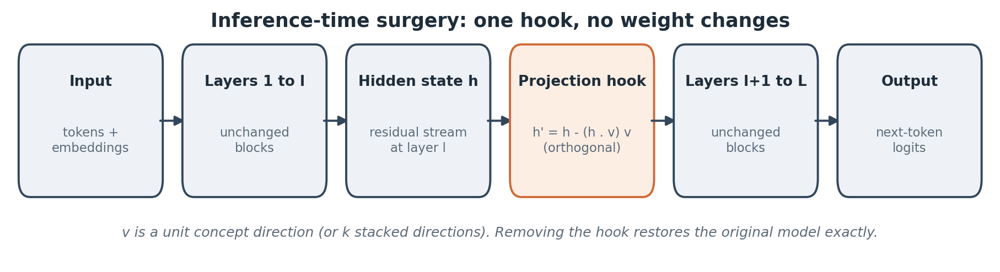
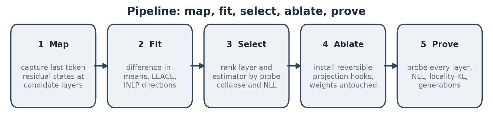
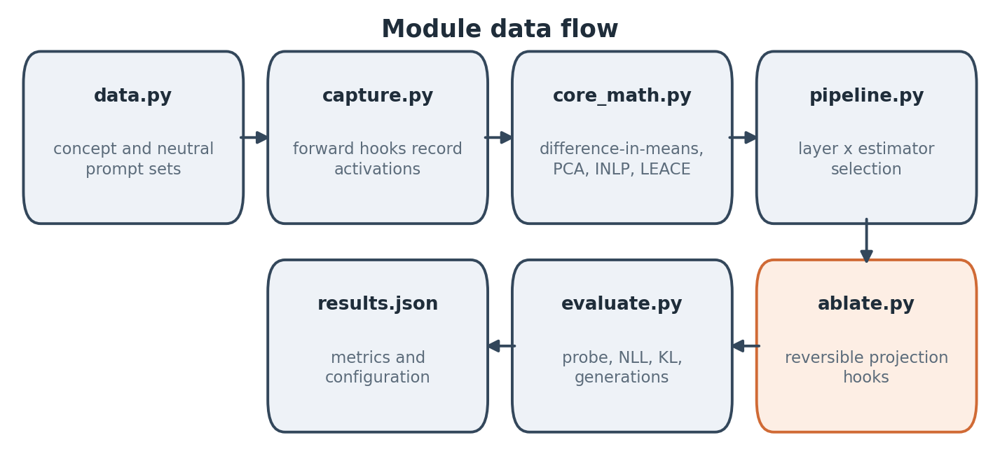
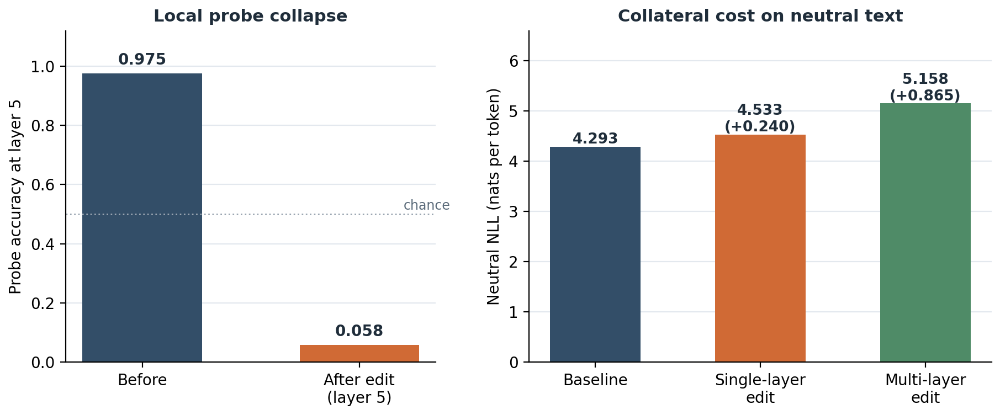
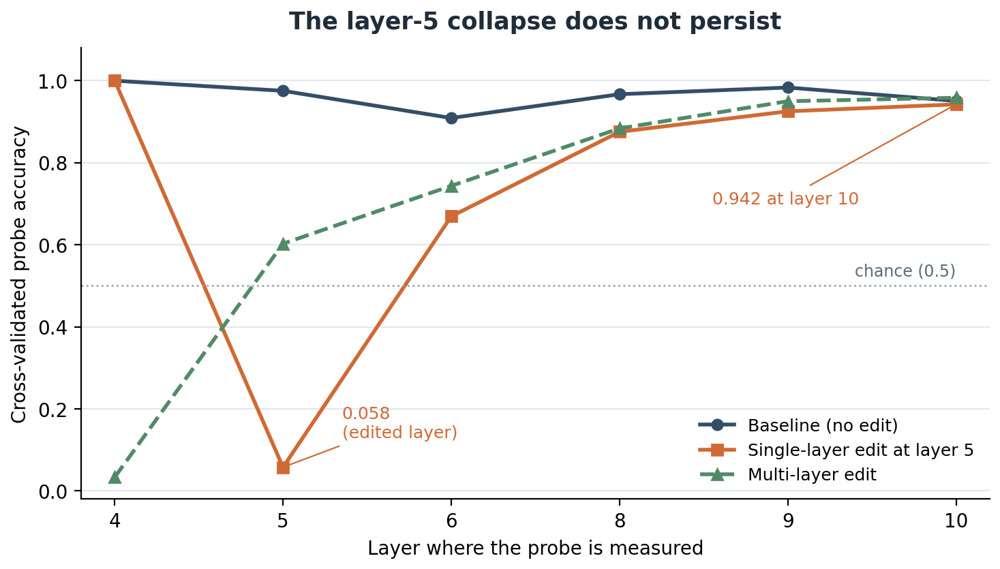

# Surgical Concept Erasure: Locating and Ablating Concept Directions in Transformer Residual Streams

**Zoe Faith Gumise**

*Version 1.2, September 2026. Includes experimental results from GPT-2 (see section 5).*

---

## Abstract

I present a reproducible pipeline for measuring whether a concept is linearly encoded in a transformer language model's residual stream, and for removing that encoding at inference time by orthogonal projection. Unlike parameter-editing approaches (ROME, MEMIT), the method leaves all weights untouched: forward hooks replace each hidden state `h` with `h − (h·v)v` at chosen layers, where `v` is a concept direction estimated from contrastive activation statistics. The codebase implements four estimators (difference-in-means, PCA of paired differences, Iterative Nullspace Projection (INLP), and a LEACE-derived eraser) under a shared evaluation protocol that measures (i) specificity (cross-validated linear-probe accuracy), (ii) collateral damage (neutral-text negative log-likelihood, NLL), and (iii) locality (KL divergence between baseline and edited next-token distributions). The saved experiment used three of these estimators; PCA was not included.

On GPT-2 with a copyright-flavored target ("Mickey Mouse"), the pipeline selects a LEACE-derived eraser at layer 5 that drops the layer-5 probe from 0.975 to 0.058, with a neutral-NLL increase of 0.240 nats and a locality KL of 0.061. The saved generations are too weak and repetitive to show that the model stopped recalling the character. The main finding is a limit: the erased signal **re-emerges at deeper layers** (probe accuracy 0.942 at layer 10 after a single-layer edit, against 0.951 before it), and ablating multiple layers does not prevent this while costing more fluency. I attribute this tentatively to recomputation from token identity when the concept is named in the input, although the experiment does not isolate the causal pathway. The result shows why depth-complete probe evaluation is needed for any erasure claim, and why a local probe collapse should not be reported as unlearning.

## 1. Introduction

When a deployed language model absorbs content it should not have, such as copyrighted fiction, toxic registers, or a targeted bias, the operator's remedies are poor. Retraining costs weeks and a great deal of money, and fine-tuning on counter-examples is unreliable and reversible. A third path has emerged from mechanistic interpretability: if a concept is encoded as a direction in activation space, it can be removed geometrically by projecting hidden states onto the nullspace of the concept direction at inference time.

The idea is attractive because the intervention is surgical by construction. It is linear, reversible (remove the hook), and needs only forward passes to install. But its viability is an empirical question, and most public demonstrations of "AI lobotomy" stop at anecdotal generations. This project builds the measurement instrument: a tested, framework-agnostic core; hook-based capture and ablation for Hugging Face models; automatic layer and estimator selection; and an evaluation protocol designed to falsify erasure claims rather than confirm them.

My contributions:

1. A **pure-NumPy core** implementing difference-in-means, PCA, INLP, and the binary-label closed-form LEACE eraser, with unit tests verifying planted-direction recovery, exact covariance annihilation, and preservation of orthogonal content.
2. A **complete pipeline** (capture, fit, select, ablate, evaluate) that I ran on GPT-2 on CPU. The hooks are written to support Llama and Phi-3 style models, which I have not yet tested.
3. A **probe-verified scorecard** (specificity, collateral damage, locality) and an automatic selection stage scored by a composite of erasure thoroughness and fluency cost.
4. A **negative result**: on a lexically cued concept, a single-layer linear ablation collapses the local probe, but the feature re-emerges downstream, and ablating multiple layers does not prevent it. My interpretation is that token-identity recomputation, not residual storage, dominates for such concepts.

## 2. Background and Related Work

**Concept erasure as a learning problem.** INLP (Ravfogel et al., 2020) erases attributes by iteratively training linear predictors and projecting into their nullspace. RLACE (Ravfogel et al., 2022) finds the erasing subspace adversarially. LEACE (Belrose et al., 2023) gives a closed-form affine eraser, with leakage rectification for degenerate labels; I implement its binary-label oblique form. My evaluation philosophy, declaring erasure only when a linear probe falls to chance, follows this line of work.

**Model editing.** ROME (Meng et al., 2022) and MEMIT (Meng et al., 2023) edit factual associations in MLP layers through rank-one weight updates. Those methods modify parameters, while mine modifies activations and is instantly reversible. The two are complementary and could be compared under the same scorecard.

**Single-direction phenomena.** Arditi et al. (2024) show that refusal in chat models is mediated by a single direction, and that ablating it disables refusal. The codebase also supports a `mode="pad"` variant that replaces the removed component with a small constant instead of zero.

**Representation engineering.** Zou et al. (2023) frame reading and steering models through activation directions. Task vectors (Hendel et al., 2023) and the linear representation hypothesis (Park et al., 2023) supply the geometric background.

## 3. Mathematical Framework

### 3.1 Setup

Let a transformer have `L` layers and hidden dimension `d`. For prompt `p`, `h_ℓ(p) ∈ R^d` is the residual-stream activation at layer `ℓ`, read at the final prompt token (left padding guarantees the final position is real). I capture matrices `X_+ ∈ R^{|C|×d}` (concept prompts) and `X_- ∈ R^{|N|×d}` (neutral prompts), matched in length and register. Otherwise the fitted direction encodes style, not content.

### 3.2 Estimating the direction

**Difference in means (DIM).**

```
v = (mean(X_+) − mean(X_-)) / ‖mean(X_+) − mean(X_-)‖
```

**PCA of paired differences.** Rows of `D = mean(X_+)·1ᵀ − X_-` share a constant offset (the concept). The leading right-singular vectors of `D` recover the concept subspace when the concept shows up through multiple surface forms. Implementation warning: centering `D` deletes the shared offset, and with it the signal. This exact bug occurred during development and is documented in the code.

**INLP.** Iteratively fit a linear regressor for the concept label, project the data into its nullspace, and repeat. Stopping rule: the next iteration's regressor finds no signal (coefficient norm underflows). A tempting but wrong convergence signal is `std(Xw)` after projection, which is zero *by construction* and truncates the loop after one direction. This bug also occurred during development and is documented.

**LEACE-style oblique eraser (binary label).** With pooled covariance `Σ` (computed against the *pooled* mean, since group-wise centering deletes the between-group signal) and `b = Σ⁺ Cov(x, z)`:

```
P = I − Σ b bᵀ / (bᵀ Σ b),     Cov(Px, z) = 0   exactly.
```

Proof: since `Cov(x, z) = Σb`,

```
Cov(Px, z) = Σb − Σb (bᵀΣb)/(bᵀΣb) = 0.
```

`P` is an idempotent oblique projection that removes the linear concept signal with minimal disturbance to the rest of the distribution under the metric defined by `Σ`. This is what distinguishes LEACE from naive mean-difference ablation.

**Implementation caveat.** In the pipeline, the fitted LEACE matrix is converted to a singular-vector subspace, and the shared ablation hook then applies an *orthogonal* projection onto that subspace. The saved run is therefore LEACE-derived, not a test of the full oblique operator `P`.

### 3.3 Ablation

Forward hooks replace layer-`ℓ` outputs `H` with

```
H' = H − (H Vᵀ)V                    (mode = "project")
H' = H − (H Vᵀ)V + ε·1 V            (mode = "pad")
```

with `V ∈ R^{k×d}` the stacked unit directions. Weights are untouched, and removing the hooks restores the model exactly.



*Figure 1. The projection hook sits between two unchanged stretches of the transformer. Removing it restores the original forward pass.*

### 3.4 Definition of "erased"

A concept is erased at layer `ℓ` only if a cross-validated linear probe trained on ablated activations cannot separate concept from neutral prompts above chance, *and* this holds at the layers downstream of the edit. A probe result at the edited layer alone is a local measurement. Generation-level failure is treated as anecdote, not evidence.

## 4. Implementation

The `concept-surgery` package separates the mathematics (`core_math.py`, pure NumPy) from model plumbing (`capture.py`, `ablate.py`) and evaluation (`evaluate.py`). The pipeline (`pipeline.py`) runs five stages:

1. **Map.** Capture activations at candidate layers (default 40% to 90% of depth, which for GPT-2 spans layers 4 to 10; the saved run scored layers 4, 5, 6, 8, 9, and 10) for both prompt sets through `register_forward_hook`.
2. **Fit.** Compute directions under each enabled estimator per layer.
3. **Select.** For each (layer, estimator) pair, temporarily apply a single-layer ablator, re-capture, and score `|probe − 0.5| + max(0, ΔNLL)`. Keep the best composite. The selection pass uses the first 40 prompts per class for the probe and 20 neutral prompts for NLL.
4. **Ablate.** Install the winning directions as persistent hooks. The pipeline also builds a multi-layer arm (every candidate layer, same method), configured with two refitting iterations under the ablated stream.
5. **Prove.** Full before and after scorecard on all activation examples (five-fold stratified cross-validation, seed 0), locality KL, and side-by-side generations. The pipeline automatically chooses between the single-layer and multi-layer arms.



*Figure 2. Map, fit, select, ablate, prove.*



*Figure 3. How the modules connect, from prompt sets to the saved results file.*

## 5. Experimental Protocol and Results

**Model.** GPT-2 (124M parameters, CPU-runnable) is the only model in the reported experiment. Llama-family and Phi-3-class models are supported by the hook code but have not been run.

**Datasets.** `mickey_mouse` (60 prompts) is the copyright-flavored target and `neutral` provides the controls. A `harry_potter` set (60 prompts) is included but was not used in the saved run. Custom concepts load from JSONL.

### 5.1 Selection and local erasure

Eighteen (layer, estimator) candidates were scored by `|probe − 0.5| + max(0, ΔNLL)`. The winner was the **LEACE-derived eraser at layer 5** (composite 0.514). It drove the layer-5 probe from 0.975 to **0.058** at a neutral-NLL cost of +0.24 nats (4.293 to 4.533 in the final scorecard; the selection pass, which used fewer prompts, saw 4.586). INLP at layer 5 scored worse on both counts (probe 0.275, neutral NLL 5.097, composite 0.976). Difference-in-means and LEACE tie to three decimals at every layer in this run, so it does not separate the two estimators.

| Metric | Baseline | Ablated (LEACE-derived @ layer 5) |
|---|---|---|
| Layer-5 probe accuracy | 0.975 | **0.058** |
| Concept NLL | 4.407 | 4.798 |
| Neutral NLL | 4.293 | 4.533 |
| Locality KL (neutral prompts) | n/a | 0.061 |



*Figure 4. Left: probe accuracy at the edited layer before and after the edit. Right: neutral-text NLL for the baseline, the single-layer edit, and the multi-layer edit.*

A probe accuracy of 0.058 sits far below the nominal 0.5 chance level, so it should be read as a collapse of this particular probe, not as a calibrated probability of forgetting.

**Generations.** The saved outputs are too weak to test forgetting. GPT-2 already fails before the edit: asked who created Mickey Mouse, the unedited model invents a birth story, and the edited model swaps in "Minnie Mouse" but repeats the same invented claim. On the story prompt, the unedited model loops on "I'm not sure", while the edited model emits a repetitive refusal that still names Minnie Mouse. Neutral prompts produce comparably poor text before and after. These outputs neither show that the model reliably recalled the character before the edit nor that it forgot the character afterward.

### 5.2 The downstream re-emergence problem

Erasure at layer 5 does not persist. Probing deeper layers recovers the concept almost to baseline:

| Probe measured at layer | Baseline | Single-layer @5 | Multi-layer |
|---|---|---|---|
| 4 | 1.000 | 1.000 | 0.033 |
| 5 | 0.975 | **0.058** | 0.603 |
| 6 | 0.909 | 0.669 | 0.744 |
| 8 | 0.967 | 0.875 | 0.884 |
| 9 | 0.983 | 0.925 | 0.950 |
| 10 | 0.951 | 0.942 | 0.958 |



*Figure 5. The single-layer edit collapses the probe at layer 5 and the signal returns by layer 10. The multi-layer edit does not keep the top layer near chance.*

Ablating the fitted direction at every candidate layer did not fix this: the layer-10 probe stayed at 0.958 while neutral NLL rose from 4.293 to 5.158 (+0.865). The multi-layer arm is configured with two refit iterations, but I did not run an experiment that isolates the effect of refitting, so I make no separate claim about it. The pipeline's automatic comparison selected the single-layer arm.

**Interpretation.** When the concept is named in the input, deep layers may recompute its representation from token identity, so residual-space ablation suppresses the feature only where it is applied. This experiment does not isolate the causal pathway. The pattern matches a split visible across the literature: ablation works cleanly for *behavioral* directions such as refusal, and is much less likely to work for *lexically grounded* content. Two consequences follow. First, any erasure claim needs probes at all depths, since a single-layer probe would make the edit look decisive. Second, for lexically cued concepts, activation-space surgery should be paired with tests on held-out paraphrases and task behavior.

I regard this negative result as one of the most useful outputs of the project: it is the kind of falsifiable finding the protocol was built to surface.

## 6. Limitations and Threats to Validity

1. **Linearity.** Only linearly encoded information is removed. Nonlinear probes and superposed features can retain decodable signal; the MLP-probe comparison is future work (section 7).
2. **Erasure is not forgetting.** The weights still contain the information, and gradient access can re-derive it. Inference-time ablation is a deployment control, not deletion.
3. **Recomputation.** Section 5.2 shows that a lexically cued concept re-emerges downstream, so activation-space methods alone cannot guarantee removal.
4. **Benchmark scope.** Collateral damage here is neutral-text NLL plus locality KL. Full capability suites (MMLU, GSM8K subsets) should accompany any deployment-flavored claim.
5. **Small-model artifact.** GPT-2 generations are low quality at baseline, so qualitative comparisons are indicative at best. The probe and NLL metrics carry the evidentiary weight.
6. **Statistical scope.** One model, one concept, one seed (seed 0), no confidence intervals or repeated-seed estimates. Selecting among 18 candidates also risks optimistic selection, and the selection-stage probe (0.225 on a 40-prompt subset) differs from the final scorecard (0.058 on the full set). The configuration records `eval_seeds: 5`, but the pipeline does not use that field to repeat the reported evaluation.
7. **Estimator scope.** The hook applies an orthogonal projection onto the LEACE-derived subspace, so the full oblique LEACE operator was not tested.

## 7. Future Work

- **Multiple concepts and paraphrases:** matched held-out prompt families, with repeated fitting, selection, and evaluation across seeds and confidence intervals.
- **Nonlinear probes** (two-layer MLP) to measure what survives linear erasure, and probes at every layer.
- **Recomputation pathways:** trace *where* the concept re-enters the residual stream (attention to concept tokens versus MLP recomputation) using path patching, and ablate the pathway, not the feature.
- **Full LEACE:** compare the oblique operator against the orthogonal hook used here.
- **Relearning dynamics:** fine-tune ablated models on a handful of concept prompts and track whether the direction re-emerges or migrates.
- **Comparison to ROME and MEMIT** under the shared scorecard.
- **SAE view:** project concept directions onto sparse-autoencoder features to name what is removed.
- **Rubric-scored generations** alongside capability and locality benchmarks.

## References

- Ravfogel, S., Elazar, Y., Gonen, H., Twiton, M., and Goldberg, Y. (2020). *Null It Out: Guarding Protected Attributes by Iterative Nullspace Projection.* ACL 2020.
- Ravfogel, S., Twiton, M., Goldberg, Y., and Cotterell, R. (2022). *Linear Adversarial Concept Erasure.* ICML 2022.
- Belrose, N., Schneider-Joseph, D., Ravfogel, S., Cotterell, R., Raff, E., and Biderman, S. (2023). *LEACE: Perfect Linear Concept Erasure in Closed Form.* NeurIPS 2023.
- Arditi, A., Obeso, O., Syed, A., Paleka, D., Panickssery, N., Gurnee, W., and Nanda, N. (2024). *Refusal in Language Models Is Mediated by a Single Direction.* NeurIPS 2024.
- Meng, K., Bau, D., Andonian, A., and Belinkov, Y. (2022). *Locating and Editing Factual Associations in GPT.* NeurIPS 2022.
- Meng, K., Sharma, A. S., Andonian, A., Belinkov, Y., and Bau, D. (2023). *Mass-Editing Memory in a Transformer.* ICLR 2023.
- Hendel, R., Geva, M., and Globerson, A. (2023). *In-Context Learning Creates Task Vectors.* Findings of EMNLP 2023.
- Park, K., Choe, Y. J., and Veitch, V. (2023). *The Linear Representation Hypothesis and the Geometry of Large Language Models.* arXiv:2311.03658.
- Zou, A., Phan, L., Chen, S., et al. (2023). *Representation Engineering: A Top-Down Approach to AI Transparency.* arXiv:2310.01405.
